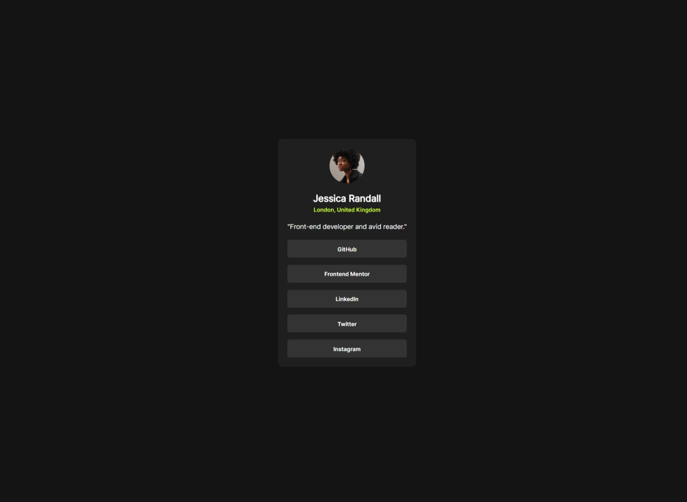

# Frontend Mentor - Social links profile solution

This is a solution to the [Social links profile challenge on Frontend Mentor](https://www.frontendmentor.io/challenges/social-links-profile-UG32l9m6dQ). Frontend Mentor challenges help you improve your coding skills by building realistic projects.

## Table of contents

- [Overview](#overview)
  - [The challenge](#the-challenge)
  - [Screenshot](#screenshot)
  - [Links](#links)
- [My process](#my-process)
  - [Built with](#built-with)
  - [What I learned](#what-i-learned)
  - [Useful resources](#useful-resources)
- [Author](#author)

## Overview

### The challenge

Users should be able to:

- See hover and focus states for all interactive elements on the page

### Screenshot

### Links

- Solution URL: [Add solution URL here](https://your-solution-url.com)
- Live Site URL: [Add live site URL here](https://your-live-site-url.com)

## My process

### Built with

- HTML5
- CSS custom properties
- CSS @font-face
- Flexbox

### What I learned

What I learned by doing this project is to use semantic HTML5 element, CSS custom properties, and CSS @font-face

### Useful resources

- [CSS Custom Properties](https://developer.mozilla.org/en-US/docs/Web/CSS/Using_CSS_custom_properties)
- [CSS @font-face](https://www.example.com)

## Author

- GitHub - [NaufalAndriantoNugraha](https://github.com/NaufalAndriantoNugraha)
- Frontend Mentor - [@NaufalAndriantoNugraha](https://www.frontendmentor.io/profile/NaufalAndriantoNugraha)
